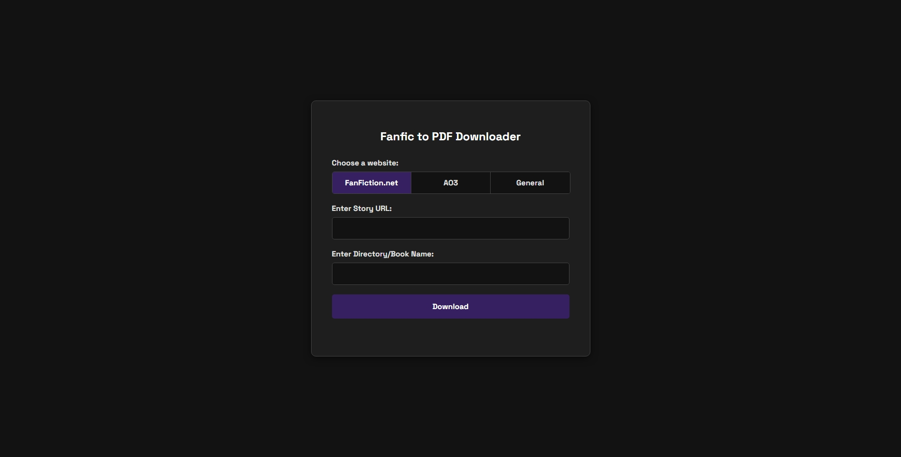

# Fanfic to PDF Downloader

A Flask-based web application that downloads stories from websites like FanFiction.net and Archive of Our Own (AO3) and converts them into a single, clean PDF file.



---

## Features

-   **Web-Based UI**: Simple and clean interface that runs locally in your browser.
-   **Multi-Site Support**: Includes specialized scrapers for:
    -   FanFiction.net
    -   Archive of Our Own (AO3)
    -   A general-purpose scraper for some blog-style index pages.
-   **Automated PDF Conversion**: Automatically scrapes all chapters, merges them into a single file, and cleans up temporary files.
-   **Robust Scraping**: Uses Selenium and `undetected-chromedriver` to bypass advanced bot detection like Cloudflare.
-   **Clean Formatting**: Applies custom stylesheets to remove website clutter (headers, footers, ads) and format the text for a pleasant, book-like reading experience.

---

## Setup and Installation

### Prerequisites
1.  **Python 3.10+**
2.  **Google Chrome**: The browser must be installed.
3.  **wkhtmltopdf**: This tool is required for PDF conversion.
    -   Download the `0.12.6-1` version from [this link](https://wkhtmltopdf.org/downloads.html).
    -   Install it to the default location (`C:\Program Files\wkhtmltopdf\`). If you install it elsewhere, you must update the path in the `CONFIG` dictionary in each scraper file.

### Installation Steps
1.  **Clone or download this repository.**
2.  **Open a terminal** in the project directory.
3.  **(Recommended) Create a virtual environment:**
    ```bash
    python -m venv venv
    venv\Scripts\activate
    ```
4.  **Install the required Python packages** using the `requirements.txt` file:
    ```bash
    pip install -r requirements.txt
    ```

---

## How to Use

1.  **Run the Flask Application**:
    ```bash
    python app.py
    ```
2.  **Open the Web Interface**: Open your web browser and navigate to **`http://127.0.0.1:5000`**.
3.  **Fill Out the Form**:
    -   **Choose a website**: Select the site you want to scrape from.
    -   **Enter Story URL**:
        -   For FanFiction.net, provide the URL of the **first chapter**.
        -   For AO3, provide the URL of the work.
        -   For General, provide the URL of the index page.
    -   **Enter Directory/Book Name**: Provide a name for the output folder and the final PDF file (e.g., `My-Awesome-Story`).
4.  **Click Download** and monitor the progress in the terminal window. The final PDF will be saved in a new folder with the name you provided.
